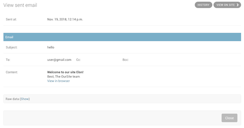
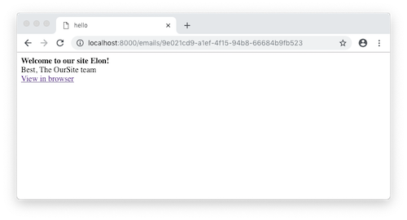

# django-enhanced-emails 💌

🔋 Batteries-included emails for Django.

- Powerful templating engine
- Multipart emails by default (HTML + text)
- Web version rendering (with admin)
- Easy file attachment
- and more ...

## Getting started

### Simple setup

- Install the package: `pipenv install django-enhanced-emails`
- Create a new email class:

  ```py
  # myapp/emails.py
  from enhanced_emails import EnhancedEmail

  class WelcomeEmail(EnhancedEmail):
      subject = "Welcome to our site!"
      html_template = "emails/welcome.html"
  ```

  ```html
  <!-- myapp/templates/emails/welcome.html -->
  <strong>Welcome to our site {{first_name}}!</strong><br />

  Best, The OurSite team
  ```

- Instanciate an email and send it:
  ```py
  email = WelcomeEmail(
      to=[user.email],
      context={
        "first_name": user.first_name
      }
  )
  email.send()
  ```
- ✨ All done! Our user received something like:

  ```email
  Content-Type: multipart/alternative;
  boundary="===============7747654958126582044=="
  MIME-Version: 1.0
  Subject: hello
  From: hello@oursite.com
  To: user@gmail.com
  Date: Wed, 11 Apr 2018 17:13:02 -0000
  Message-ID: <152346678269.275.17989388690220812241@cf7f5f3375c9>

  --===============7747654958126582044==
  Content-Type: text/plain; charset="utf-8"
  MIME-Version: 1.0
  Content-Transfer-Encoding: 7bit

  Welcome to our site Elon!

  Best,
  The OurSite team
  --===============7747654958126582044==
  Content-Type: text/html; charset="utf-8"
  MIME-Version: 1.0
  Content-Transfer-Encoding: 7bit

  <strong>Welcome to our site Elon!</strong>

  Best,
  The OurSite team
  --===============7747654958126582044==--
  ```

### Advanced setup (for web version rendering)

- Add the `enhanced_emails` app to `INSTALLED_APPS`:
  ```py
  # settings.py
  INSTALLED_APPS = [
      ...
      "enhanced_emails",
      ...
  ]
  ```
- Add a new entry to `urlpatterns`:
  ```py
  # urls.py
  urlpatterns = [
      path("admin/", admin.site.urls),
      path("emails/", include("enhanced_emails.urls")),
      ...
  ]
  ```
- Use `WebVersionEnhancedEmail` instead of `EnhancedEmail`:

  ```py
  from enhanced_emails import WebVersionEnhancedEmail

  class WelcomeEmail(WebVersionEnhancedEmail):
      subject = "Welcome to our site!"
      html_template = "emails/welcome.html"
  ```

- Use the `web_url` variable in the email template:

  ```html
  <!-- myapp/templates/emails/welcome.html -->
  <strong>Welcome to our site {{ first_name }}!</strong><br />

  Best, The OurSite team<br />

  <a href="{{ web_url }}">View in browser</a>
  ```

- Instanciate an email and send it (notice that we need to pass the request as well now):

  ```py
  email = WelcomeEmail(
      to=[user.email],
      context={
        'first_name': user.first_name
      },
      request=request
  )
  email.send()
  ```

- The email is visible in the admin and on the site! ✨<br/>
  
  

## Development

- Deploy: `python setup.py sdist && twine upload dist/*`
